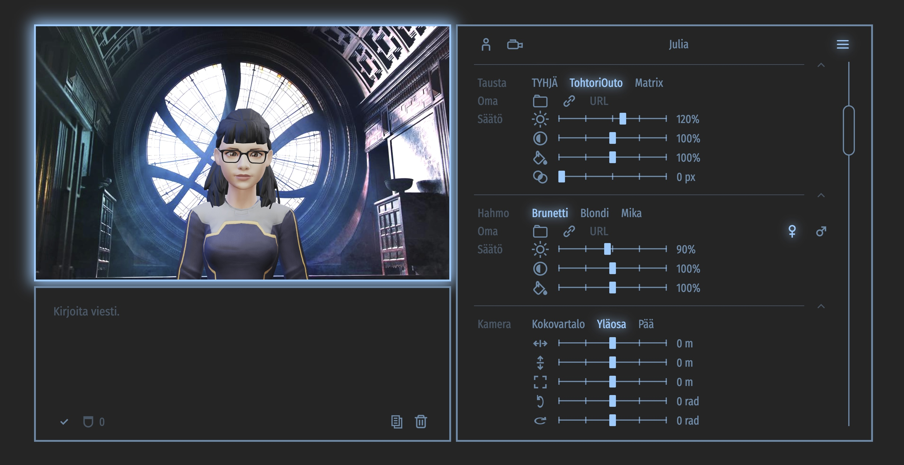

# Talking Head (Finnish/3D)

**UNDER CONSTRUCTION**

### Screenshots

<br/>

<br/>

### Introduction

This is as a small side-project featuring a 3D talking head capable of speaking and lip-syncing in Finnish. The Talking Head supports [Ready Player Me](https://readyplayer.me/) full-body 3D avatars (GLB), [Mixamo](https://www.mixamo.com) animations (FBX), markdown text and subtitles. It also knows a set of emojis, which it can convert into facial expressions. See Appendix A for how to make your own avatar.

The class `TalkingHead` can be found in the module `./modules/talkinghead.mjs`. The class uses [Google Text-to-Speech API](https://cloud.google.com/text-to-speech), [ThreeJS](https://github.com/mrdoob/three.js/)/WebGL for 3D rendering, and [Marked](https://github.com/markedjs/marked) Markdown parser.

The included example app `index.html` shows how to integrate and use the class with [OpenAI API](https://openai.com) and [ElevenLabs WebSocket API](https://elevenlabs.io). Using the app you can chat with the avatar using GPT-3.5 or GPT-4.

**NOTE:** Google TTS, OpenAI and ElevenLabs APIs are all paid services that require API keys. These API keys are not included, of course, and since it is NOT recommended to put API keys in any client-side code, the class/app calls these external services through proxies. Creating the needed API proxies is not in the scope of this project, but since there is not a lot you can do with the app without them, see Appendix B for how you might implement them in your own web server by using a JSON Web Token (JWT) Single Sign-On.


### Talking Head class

Init parameter | Description
--- | ---
`node` | DOM element for the Talking Head.
`opt` | Object for global default options. Refer to the next table for options and defaults.

Option | Description
--- | ---
`jwsGet` | Function to get the JSON Web Token (JWT).
`ttsEndpoint` | Text-to-speech backend/endpoint/proxy implementing the Google Text-to-Speech API.
`ttsApikey` | Google Text-to-Speech API key when using the Google TTS endpoint. **NOTE: Don't use this in client-side code in production**
`ttsLang` | Google text-to-speech language. Default is `"fi-FI"`.
`ttsVoice` | Google text-to-speech voice. Default is `"fi-FI-Standard-A"`.
`ttsRate` | Google text-to-speech rate in the range [0.25, 4.0]. Default is `0.95`.
`ttsPitch` | Google text-to-speech pitch in the range [-20.0, 20.0]. Default is `0`.
`ttsVolume` | Google text-to-speech volume gain (in dB) in the range [-96.0, 16.0]. Default is `0`.
`ttsTrimStart` | Trim the viseme sequence start relative to the beginning of the audio (shift in milliseconds). Default is `0`.
`ttsTrimEnd`| Trim the viseme sequence end relative to the end of the audio (shift in milliseconds). Default is `300`.
`modelPixelRatio` | Sets the device's pixel ratio. Default is `1`.
`modelFPS` | Frames per second. Default is `30`.
`cameraView` | Initial view. Supported views are `"full"`, `"upper"`  and `"head"`. Default is `"full"`.
`cameraDistance` | Camera distance offset for initial view in meters. Default is `0`.
`cameraX` | Camera position offset in X direction in meters. Default is `0`.
`cameraY` | Camera position offset in Y direction in meters. Default is `0`.
`cameraRotateX` | Camera rotation offset in X direction in radians. Default is `0`.
`cameraRotateY` | Camera rotation offset in Y direction in radians. Default is `0`.
`cameraRotateEnable` | If true, the user is allowed to rotate the 3D model. Default is `true`.
`cameraPanEnable` | If true, the user is allowed to pan the 3D model. Default is `false`.
`cameraZoomEnable` | If true, the user is allowed to zoom the 3D model. Default is `false`.
`avatarMood` | The mood of the avatar. Supported moods: `"neutral"`, `"happy"`, `"angry"`, `"sad"`, `"fear"`, `"disgust"`, `"love"`, `"sleep"`. Default is `"neutral"`.
`avatarMute`| Mute the avatar. This can be helpful option if you want to output subtitles without audio and lip-sync. Default is `false`.
`markedOptions` | Options for Marked markdown parser. Default is `{ mangle:false, headerIds:false, breaks: true }`.

The following table lists some of the key methods. See the source code for the rest.

Method | Description
--- | ---
`showAvatar(avatar, [onprogress=null])` | Load and show the specified avatar. The `avatar` object must include the `url` for GLB file. Optional properties are `body` for either male `M` or female `F` body form, `ttsLang`, `ttsVoice`, `ttsRate`, `ttsPitch`, `ttsVolume`, `avatarMood` and `avatarMute`.
`setView(view, [opt])` | Set view. Supported views are `"full"`, `"upper"`  and `"head"`. Options `opt` can be used to set `cameraDistance`, `cameraX`, `cameraY`, `cameraRotateX`, `cameraRotateY`.
`speakText(text, [opt={}], [onsubtitles=null], [excludes=[]])` | Add the `text` string to the speech queue. The text can contain face emojis. Options `opt` can be used to set text-specific `ttsLang`, `ttsVoice`, `ttsRate`, `ttsPitch`, `ttsVolume`, `avatarMood`, `avatarMute`. Optional callback function `onsubtitles` is called whenever a new subtitle is to be written with the parameter of the added string. The optional `excludes` is an array of [start,end] indices to be excluded from audio but to be included in the subtitles.
`speakAudio(audio, [onsubtitles=null])` | Add the `audio` object to the speech queue. The audio object contains `audio` ArrayBuffer, characters in `chars` array, starting times of each character in milliseconds in `ts` array, and durations of each character in milliseconds in `ds` array.
`lookAt(x,y,t)` | Make the avatar's head turn to look at the screen position (`x`,`y`) for `t` milliseconds.
`lookAtCamera(t)` | Make the avatar's head turn to look at the camera for `t` milliseconds.
`setMood(mood)` | Set avatar mood.
`playAnimation(url, [onprogress=null], [repeat=1], [ndx=0], [scale=0.01])` | Play Mixamo animation file. Repeat `repeat` times. If the FBX file includes several animations, the parameter `ndx` specifies the index. Since Mixamo rigs have a scale 100 and RPM a scale 1, the `scale` factor can be used to scale the positions.
`stopAnimation()` | Stop the current animation started by `playAnimation`.
`playPose(url, [onprogress=null], [dur=5], [ndx=0], [scale=0.01])` | Play the initial pose of a Mixamo animation file for `dur` seconds. If the FBX file includes several animations, the parameter `ndx` specifies the index. Since Mixamo rigs have a scale 100 and RPM a scale 1, the `scale` factor can be used to scale the positions.
`stopPose()` | Stop the current pose started by `playPose`.
`start` | Start/re-start the Talking Head animation loop.
`stop` | Stop the Talking Head animation loop.


### FAQ

**Why only Finnish?**

The primary reason is that Finnish is my native language, and I just happened to have a use case for a Finnish-speaking avatar. Finnish language is also very special in that if has a consistent one-to-one mapping between individual letters and phonemes/visemes. Achieving a similar level of lip-sync accuracy in English would likely demand an extensive English word database/vocabulary.

**Why Google TTS? Why not use the free Web Speech API?**

Currently the starting times and the durations of individual visemes are calculated based on the length of the generated audio chunk. As far as I know, there is no easy way to get Web Speech API speech synthesis as an audio file or otherwise determine its duration in advance. At some point I tried to use the Web Speech API events for syncronization, but the results were not good. The ElevenLabs API returns the word-to-audio alignment information, which is great for this purpose!


### See also

[Finnish pronunciation](https://en.wiktionary.org/wiki/Appendix:Finnish_pronunciation), Wiktionary

### Appendix A: Create Your Own 3D Avatar

1. Create your own full-body avatar free at [https://readyplayer.me](https://readyplayer.me)

2. Copy the given URL and add the following URL parameters in order to include all the needed morph targets:<br>`morphTargets=ARKit,Oculus+Visemes,mouthOpen,mouthSmile,eyesClosed,eyesLookUp,eyesLookDown&textureSizeLimit=1024&textureFormat=png`<br><br>Your final URL should look something like this:<br>`https://models.readyplayer.me/64bfa15f0e72c63d7c3934a6.glb?morphTargets=ARKit,Oculus+Visemes,mouthOpen,mouthSmile,eyesClosed,eyesLookUp,eyesLookDown&textureSizeLimit=1024&textureFormat=png`

3. Use the URL to download the GLB file to your own web server.


### Appendix B: Create API Proxies with JSON Web Token (JWT) Single Sign-On (SSO)

1. Make a CGI script that generates a new JSON Web Token with an expiration time (exp). See [jwt.io](https://jwt.io) for more information about JWT and libraries that best fit your needs and architecture.

2. Protect your CGI script with some authentication scheme. Below is an example Apache 2.4 directory config that uses Basic authentication (remember to always use HTTPS/SSL!). Put your CGI script `get` in the `jwt` directory.

```apacheconf
# Restricted applications
<Directory "/var/www/app">
  AuthType Basic
  AuthName "Restricted apps"
  AuthUserFile /etc/httpd/.htpasswd
  Require valid-user
</Directory>

# JSON Web Token
<Directory "/var/www/app/jwt" >
  Options ExecCGI
  SetEnv REMOTE_USER %{REMOTE_USER}
  SetHandler cgi-script
</Directory>
```

3. Make an [External Rewriting Program](https://httpd.apache.org/docs/2.4/rewrite/rewritemap.html#prg) script that verifies JSON Web Tokens. The script should return `OK` if the given token is not expired and its signature is valid. Start the script in Apache 2.4 config. (Note: User's don't use the verifier script directly, so put it in some internal directory, not under document root.)

```apacheconf
# JSON Web Token verifier
RewriteEngine On
RewriteMap jwtverify "prg:/etc/httpd/jwtverify" apache:apache
```

4. Make a forward proxy for each service in which you add the required API key and protect the proxy with the JWT token verifier. Below is an example config for OpenAI API proxy using Apache 2.4 web server.

```apacheconf
# OpenAI API
<Location /openai/>
  RewriteCond ${jwtverify:%{http:Authorization}} !OK
  RewriteRule .+ - [F]
  ProxyPass https://api.openai.com/ connectiontimeout=30 timeout=30 keepalive=on max=20 ttl=120 retry=5
  RequestHeader set Authorization "Bearer <insert-your-openai-api-key-here>"
</Location>
```

**NOTE:** The app also uses ElevenLabs' WebSockets API, and by using browser JavaScript you can't add authentication headers when opening a new WebSocket connection. In the app this problem is solved by including the JWT token as a part of the request URL. The downside is that the token might end up in server log files. However, this is typically not a problem as long as you are using HTTPS/SSL and the expiration time of the token is not too long. Below is an example of how you might implement a WebSocket proxy in Apache 2.4:

```apacheconf
# ElevenLabs Text-to-speech API
<LocationMatch /elevenlabs/(?<jwt>[^/]+)/>
  RewriteCond ${jwtverify:%{env:MATCH_JWT}} !OK
  RewriteRule .+ - [F]

  RewriteCond %{HTTP:Connection} Upgrade [NC]
  RewriteCond %{HTTP:Upgrade} websocket [NC]
  RewriteRule /elevenlabs/[^/]+/(.+) "wss://api.elevenlabs.io/$1" [P]

  RequestHeader set "xi-api-key" "<add-your-elevenlabs-api-key-here>"
</LocationMatch>
```
