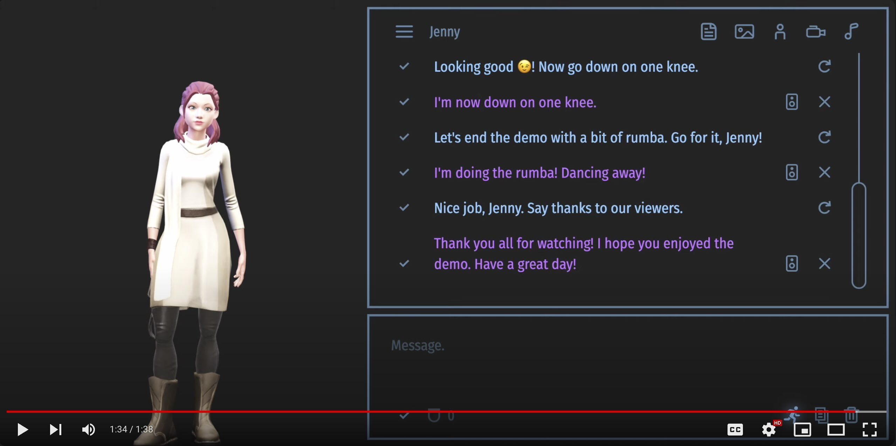
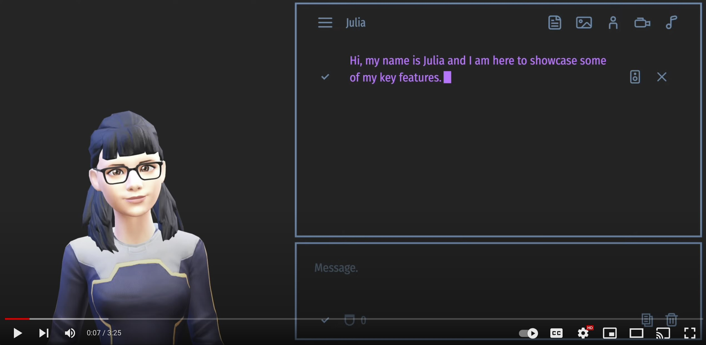

# Talking Head (3D)

### Demo videos

Video | Description
--- | ---
<span style="display: block; width:400px">[](https://youtu.be/OA6LBZjkzJI)</span> | I chat with Jenny and Harri. The close-up view allows you to evaluate the accuracy of lip-sync in both English and Finnish. Using GPT-3.5 and Microsoft text-to-speech.
[](https://youtu.be/fJrYGaGCAGo) | A short demo of how AI can control the avatar's movements. Using OpenAI's function calling and Google TTS with the built-in viseme generation.
[](https://youtu.be/SfnqRnWKT40) | Julia and I showcase some of the features of the TalkingHead class/app including the settings, some poses and animations.

*All videos are real-time screen captures from a Chrome browser running
the TalkingHead example web app without any post-processing.*

---

### Introduction

This is as a small side-project featuring a 3D talking head capable
of speaking and lip-syncing in real-time. The Talking Head supports
[Ready Player Me](https://readyplayer.me/) full-body 3D avatars (GLB),
[Mixamo](https://www.mixamo.com) animations (FBX), markdown text, and subtitles.
It also knows a set of emojis, which it can convert into facial expressions.

You can integrate the TalkingHead class with all major text-to-speech services.
If you use a TTS service that can provide visemes with timestamps,
such as Microsoft Azure Speech Services, you can have accurate lip-sync across
multiple languages. If you use a more affordable solution without visemes,
such as Google TTS with four million free characters per month,
you are limited to the built-in lip-sync in Finnish and English.

The class `TalkingHead` can be found in the module `./modules/talkinghead.mjs`.
The class uses [ThreeJS](https://github.com/mrdoob/three.js/) / WebGL for 3D
rendering, and [Marked](https://github.com/markedjs/marked) Markdown parser.
As a default built-in TTS service, the class uses
[Google TTS](https://cloud.google.com/text-to-speech)
with language-specific lip-sync modules `./modules/lipsync-fi.mjs`
and `./modules/lipsync-en.mjs`.

The included example web app `index.html` shows how to integrate and use
the class with [ElevenLabs WebSocket API](https://elevenlabs.io) (experimental),
[Microsoft Azure Speech SDK](https://github.com/microsoft/cognitive-services-speech-sdk-js),
[OpenAI API](https://openai.com) and
[Gemini Pro API](https://cloud.google.com/vertex-ai) (pre-GA).
Background view examples are from
[Virtual Backgrounds](https://virtualbackgrounds.site) and impulse
responses (IR) for reverb effects are from [OpenAir](www.openairlib.net).
See Appendix A for how to make your own free 3D avatar.

The class/app calls external paid services through API proxies. Creating
the needed API proxies is not within the scope of this project.
However, given the limited functionality without them, please refer
to Appendix B for guidance on implementing them on your own web
server using JSON Web Token (JWT) Single Sign-On.

You can preview the example app's UI [here](https://met4citizen.github.io/TalkingHead/).
Please note that since the API proxies for the text-to-speech and
AI services are missing, the avatar does not speak or lip-sync, and
you can't chat with it.

---

### Talking Head class

In order to create an instance of the Talking Head, you need to provide it with
a DOM element and a set of global options. If you want to use the built-in
Google TTS functionality, you need to give it your proxy endpoint and
a function from which to obtain the JSON Web Token needed to use that
proxy (See Appendix B).

```javascript
// Create the talking head avatar
const nodeAvatar = document.getElementById('avatar');
const head = new TalkingHead( nodeAvatar, {
  ttsEndpoint: "/gtts/",
  jwtGet: jwtGet
});
```

The following table lists all the available options and their default values:

Option | Description
--- | ---
`jwsGet` | Function to get the JSON Web Token (JWT).
`ttsEndpoint` | Text-to-speech backend/endpoint/proxy implementing the Google Text-to-Speech API.
`ttsApikey` | Google Text-to-Speech API key when using the Google TTS endpoint. **NOTE: Don't use this in client-side code in production**
`ttsLang` | Google text-to-speech language. Default is `"fi-FI"`.
`ttsVoice` | Google text-to-speech voice. Default is `"fi-FI-Standard-A"`.
`ttsRate` | Google text-to-speech rate in the range [0.25, 4.0]. Default is `0.95`.
`ttsPitch` | Google text-to-speech pitch in the range [-20.0, 20.0]. Default is `0`.
`ttsVolume` | Google text-to-speech volume gain (in dB) in the range [-96.0, 16.0]. Default is `0`.
`ttsTrimStart` | Trim the viseme sequence start relative to the beginning of the audio (shift in milliseconds). Default is `0`.
`ttsTrimEnd`| Trim the viseme sequence end relative to the end of the audio (shift in milliseconds). Default is `300`.
`lipsyncLang`| Lip-sync language. Currently English `en` and Finnish `fi` are supported. Default is `fi`.
`pcmSampleRate` | PCM (signed 16bit little endian) sample rate used in `speakAudio` in Hz. Default is `22050`.
`modelPixelRatio` | Sets the device's pixel ratio. Default is `1`.
`modelFPS` | Frames per second. Note that actual frame will be lower than the set value. Default is `30`.
`cameraView` | Initial view. Supported views are `"full"`, `"upper"`  and `"head"`. Default is `"full"`.
`cameraDistance` | Camera distance offset for initial view in meters. Default is `0`.
`cameraX` | Camera position offset in X direction in meters. Default is `0`.
`cameraY` | Camera position offset in Y direction in meters. Default is `0`.
`cameraRotateX` | Camera rotation offset in X direction in radians. Default is `0`.
`cameraRotateY` | Camera rotation offset in Y direction in radians. Default is `0`.
`cameraRotateEnable` | If true, the user is allowed to rotate the 3D model. Default is `true`.
`cameraPanEnable` | If true, the user is allowed to pan the 3D model. Default is `false`.
`cameraZoomEnable` | If true, the user is allowed to zoom the 3D model. Default is `false`.
`lightAmbientColor` | Ambient light color. The value can be a hexadecimal color or CSS-style string. Default is `0xffffff`.
`lightAmbientIntensity` | Ambient light intensity. Default is `2`.
`lightDirectColor` | Direction light color. The value can be a hexadecimal color or CSS-style string. Default is `0x8888aa`.
`lightDirectIntensity` | Direction light intensity. Default is `30`.
`lightDirectPhi` | Direction light phi angle. Default is `0.1`.
`lightDirectTheta` | Direction light theta angle. Default is `2`.
`lightSpotColor` | Spot light color. The value can be a hexadecimal color or CSS-style string. Default is `0x3388ff`.
`lightSpotIntensity` | Spot light intensity. Default is `0`.
`lightSpotPhi` | Spot light phi angle. Default is `0.1`.
`lightSpotTheta` | Spot light theta angle. Default is `4`.
`lightSpotDispersion` | Spot light dispersion. Default is `1`.
`avatarMood` | The mood of the avatar. Supported moods: `"neutral"`, `"happy"`, `"angry"`, `"sad"`, `"fear"`, `"disgust"`, `"love"`, `"sleep"`. Default is `"neutral"`.
`avatarMute`| Mute the avatar. This can be helpful option if you want to output subtitles without audio and lip-sync. Default is `false`.
`markedOptions` | Options for Marked markdown parser. Default is `{ mangle:false, headerIds:false, breaks: true }`.
`statsNode` | Parent DOM element for the three.js stats display. If `null`, don't use. Default is `null`.
`statsStyle` | CSS style for the stats element. If `null`, use the three.js default style. Default is `null`.

Once the instance has been created, you can load your avatar:

```javascript
try {
  await head.showAvatar( {
    url: './avatars/brunette.glb',
    body: 'F',
    avatarMood: 'neutral'
  }, function(ev) {
    if ( ev.lengthComputable ) {
      let val = Math.round(ev.loaded/ev.total * 100 );
      console.info(val+"% loaded");
    }
  });
  head.speakText("Lataus onnistui hyvin!", { lipsyncLang: 'fi' } );
} catch (error) {
  console.log(error);
}
```

The following table lists some of the key methods. See the source code for the rest:

Method | Description
--- | ---
`showAvatar(avatar, [onprogress=null])` | Load and show the specified avatar. The `avatar` object must include the `url` for GLB file. Optional properties are `body` for either male `M` or female `F` body form, `lipsyncLang`, `ttsLang`, `ttsVoice`, `ttsRate`, `ttsPitch`, `ttsVolume`, `avatarMood` and `avatarMute`.
`setView(view, [opt])` | Set view. Supported views are `"full"`, `"upper"`  and `"head"`. The `opt` object can be used to set `cameraDistance`, `cameraX`, `cameraY`, `cameraRotateX`, `cameraRotateY`.
`setLighting(opt)` | Change lighting settings. The `opt` object can be used to set `lightAmbientColor`, `lightAmbientIntensity`, `lightDirectColor`, `lightDirectIntensity`, `lightDirectPhi`, `lightDirectTheta`, `lightSpotColor`, `lightSpotIntensity`, `lightSpotPhi`, `lightSpotTheta`, `lightSpotDispersion`.
`speakText(text, [opt={}], [onsubtitles=null], [excludes=[]])` | Add the `text` string to the speech queue. The text can contain face emojis. Options `opt` can be used to set text-specific `lipsyncLang`, `ttsLang`, `ttsVoice`, `ttsRate`, `ttsPitch`, `ttsVolume`, `avatarMood`, `avatarMute`. Optional callback function `onsubtitles` is called whenever a new subtitle is to be written with the parameter of the added string. The optional `excludes` is an array of [start,end] indices to be excluded from audio but to be included in the subtitles.
`speakAudio(audio, [opt={}], [onsubtitles=null])` | Add a new `audio` object to the speech queue. This method was added to support external TTS services such as ElevenLabs and Azure. The audio object contains ArrayBuffer chunks in `audio` array, words in `words` array, starting times for each words in milliseconds in `wtimes` array, and durations for each words in milliseconds in `wdurations` array. If the Oculus viseme IDs are know, they can be given in optional `visemes`, `vtimes` and `vdurations` arrays. NOTE: As of now, the only supported audio format is PCM signed 16bit little endian. The `opt` object can be used to set text-specific `lipsyncLang` in cases when the visemes are not specified.
`speakEmoji(e)` | Add an emoji `e` to the speech queue.
`speakBreak(t)` | Add a break of `t` milliseconds to the speech queue.
`speakMarker(onmarker)` | Add a marker to the speech queue. The callback function `onmarker` is called when the queue processes the event.
`lookAt(x,y,t)` | Make the avatar's head turn to look at the screen position (`x`,`y`) for `t` milliseconds.
`lookAtCamera(t)` | Make the avatar's head turn to look at the camera for `t` milliseconds.
`setMood(mood)` | Set avatar mood.
`playBackgroundAudio(url)` | Play background audio such as ambient sounds/music in a loop.
`stopBackgroundAudio()` | Stop playing the background audio.
`playAnimation(url, [onprogress=null], [dur=10], [ndx=0], [scale=0.01])` | Play Mixamo animation file for `dur` seconds, but full rounds and at least once. If the FBX file includes several animations, the parameter `ndx` specifies the index. Since Mixamo rigs have a scale 100 and RPM a scale 1, the `scale` factor can be used to scale the positions.
`stopAnimation()` | Stop the current animation started by `playAnimation`.
`playPose(url, [onprogress=null], [dur=5], [ndx=0], [scale=0.01])` | Play the initial pose of a Mixamo animation file for `dur` seconds. If the FBX file includes several animations, the parameter `ndx` specifies the index. Since Mixamo rigs have a scale 100 and RPM a scale 1, the `scale` factor can be used to scale the positions.
`stopPose()` | Stop the current pose started by `playPose`.
`start` | Start/re-start the Talking Head animation loop.
`stop` | Stop the Talking Head animation loop.

---

### The Example App

In order to configure and use the example app `index.html` do the following:

1. Copy the project to your own server.

2. Create the needed API proxies as described in Appendix B and check/update your endpoint/proxy configuration in `index.html`:

```javascript
// API endpoints/proxys
const jwtEndpoint = "/app/jwt/get"; // Get JSON Web Token for Single Sign-On
const openaiChatCompletionsProxy = "/openai/v1/chat/completions";
const openaiModerationsProxy = "/openai/v1/moderations";
const vertexaiChatCompletionsProxy = "/vertexai/";
const googleTTSProxy = "/gtts/";
const elevenTTSProxy = [
  "wss://" + window.location.host + "/elevenlabs/",
  "/v1/text-to-speech/",
  "/stream-input?model_id=eleven_multilingual_v2&output_format=pcm_22050"
];
const microsoftTTSProxy = [
  "wss://" + window.location.host + "/mstts/",
  "/cognitiveservices/websocket/v1"
];
```

3. The example app's UI supports both Finnish and English. If you want to add another language, you need to add an another entry to the `i18n` object.

4. Add you own background images, videos, audio files, avatars etc. in the directory structure and update your site configuration `siteconfig.js` accordingly. The keys are in English, but the entries can include translations to other languages.

```javascript
// Site configuration
export const site = {

  // Preset avatars
  avatars: {
    'Brunette': {
      url: './avatars/brunette.glb',
      body: 'F',
      avatarMood: 'neutral',
      fi: 'Brunetti'
    }
  },

  // Google voices
  googleVoices: {
    "fi-F": { id: "fi-FI-Standard-A" },
    "lv-M": { id: "lv-LV-Standard-A" },
    "lt-M": { id: "lt-LT-Standard-A" },
    "en-F": { id: "en-GB-Standard-A" },
    "en-M": { id: "en-GB-Standard-D" }
  },

  // ElevenLab voices
  elevenVoices: {
    "Bella": { id: "EXAVITQu4vr4xnSDxMaL" },
    "Elli": { id: "MF3mGyEYCl7XYWbV9V6O" },
    "Rachel": { id: "21m00Tcm4TlvDq8ikWAM" },
    "Adam": { id: "pNInz6obpgDQGcFmaJgB" },
    "Antoni": { id: "ErXwobaYiN019PkySvjV" },
    "Arnold": { id: "VR6AewLTigWG4xSOukaG" },
    "Domi": { id: "AZnzlk1XvdvUeBnXmlld" },
    "Josh": { id: "TxGEqnHWrfWFTfGW9XjX" },
    "Sam": { id: "yoZ06aMxZJJ28mfd3POQ" }
  },

  // Microsoft voices
  microsoftVoices: {
    "fi-Selma": { lang: "fi-FI", id: "fi-FI-SelmaNeural" },
    "fi-Noora": { lang: "fi-FI", id: "fi-FI-NooraNeural" },
    "fi-Harri": { lang: "fi-FI", id: "fi-FI-HarriNeural" },
    "en-Jenny": { lang: "en-US", id: "en-US-JennyNeural"},
    "en-Tony": { lang: "en-US", id: "en-US-TonyNeural" },
  },

  // Preset views
  views: {
    'DrStrange': { url: './views/strange.jpg', type: 'image/jpg', fi: 'TohtoriOuto' },
    'Matrix': { url: './views/matrix.mp4', type: 'video/mp4' }
  },

  // Preset poses (in addition to internal poses)
  poses: {
    'Dance': { url: './poses/dance.fbx', fi: 'Tanssi' }
  },

  // Preset animations
  animations: {
    'Walking': { url: './animations/walking.fbx', fi: 'Kävely' }
  },

  // Impulse responses
  impulses: {
    'Room': { url: './audio/ir-room.m4a', fi: 'Huone' },
    'Basement': { url: './audio/ir-basement.m4a', fi: 'Kellari' },
    'Forest': { url: './audio/ir-forest.m4a', fi: 'Metsä' },
    'Church': { url: './audio/ir-church.m4a', fi: 'Kirkko' }
  },

  // Background ambient sounds/music
  music: {
    'Murmur': { url: './audio/murmur.mp3', fi: 'Puheensorina'}
  }

};
```

---

### FAQ

**Why not use the free Web Speech API?**

The free Web Speech API can't provide word-to-audio timestamps, which are
essential for accurate lip-sync. As far as I know, there is no way even to
get Web Speech API speech synthesis as an audio file or determine its
duration in advance. At some point I tried to use the Web Speech API
events for syncronization, but the results were not good.

**I would like to have lip-sync support for language X.**

You have two options. First, you can implement a word-to-viseme
class similar to those that currently exist for English and Finnish.
Alternatively, you can check if Microsoft Azure TTS can provide visemes
for your language and use Microsoft Speech API integration (speakAudio)
instead of Google TTS and the built-in lip-sync (speakText).

**Any future plans for the project?**

This is just a small side-project for me, so I don't have any big
plans for it. That said, there are several companies that are currently
developing text-to-3D-avatar and text-to-3D-animation features. If and
when they get released as APIs, I will probably take a look at them and see
if they can be used/integrated in some way to the project.


---

### See also

[1] [Finnish pronunciation](https://en.wiktionary.org/wiki/Appendix:Finnish_pronunciation), Wiktionary

[2] Elovitz, H. S., Johnson, R. W., McHugh, A., Shore, J. E., Automatic
Translation of English Text to Phonetics by Means of Letter-to-Sound Rules
(NRL Report 7948). Naval Research Laboratory (NRL).
Washington, D. C., 1976. https://apps.dtic.mil/sti/pdfs/ADA021929.pdf

---

### Appendix A: Create Your Own 3D Avatar

1. Create your own full-body avatar free at [https://readyplayer.me](https://readyplayer.me)

2. Copy the given URL and add the following URL parameters in order to include all the needed morph targets:<br>`morphTargets=ARKit,Oculus+Visemes,mouthOpen,mouthSmile,eyesClosed,eyesLookUp,eyesLookDown&textureSizeLimit=1024&textureFormat=png`<br><br>Your final URL should look something like this:<br>`https://models.readyplayer.me/64bfa15f0e72c63d7c3934a6.glb?morphTargets=ARKit,Oculus+Visemes,mouthOpen,mouthSmile,eyesClosed,eyesLookUp,eyesLookDown&textureSizeLimit=1024&textureFormat=png`

3. Use the URL to download the GLB file to your own web server.

---

### Appendix B: Create API Proxies with JSON Web Token (JWT) Single Sign-On (SSO)

1. Make a CGI script that generates a new JSON Web Token with an expiration time (exp). See [jwt.io](https://jwt.io) for more information about JWT and libraries that best fit your needs and architecture.

2. Protect your CGI script with some authentication scheme. Below is an example Apache 2.4 directory config that uses Basic authentication (remember to always use HTTPS/SSL!). Put your CGI script `get` in the `jwt` directory.

```apacheconf
# Restricted applications
<Directory "/var/www/app">
  AuthType Basic
  AuthName "Restricted apps"
  AuthUserFile /etc/httpd/.htpasswd
  Require valid-user
</Directory>

# JSON Web Token
<Directory "/var/www/app/jwt" >
  Options ExecCGI
  SetEnv REMOTE_USER %{REMOTE_USER}
  SetHandler cgi-script
</Directory>
```

3. Make an [External Rewriting Program](https://httpd.apache.org/docs/2.4/rewrite/rewritemap.html#prg) script that verifies JSON Web Tokens. The script should return `OK` if the given token is not expired and its signature is valid. Start the script in Apache 2.4 config. User's don't use the verifier script directly, so put it in some internal directory, not under document root.

```apacheconf
# JSON Web Token verifier
RewriteEngine On
RewriteMap jwtverify "prg:/etc/httpd/jwtverify" apache:apache
```

4. Make a proxy configuration for each service you want to use. Add the required API keys and protect the proxies with the JWT token verifier. Below are some example configs for Apache 2.4 web server. Note that when opening a WebSocket connection (ElevenLabs, Azure) you can't add authentication headers in browser JavaScript. This problem is solved here by including the JWT token as a part of the request URL. The downside is that the token might end up in server log files. This is typically not a problem as long as you are controlling the proxy server, you are using HTTPS/SSL, and the token has an expiration time.


```apacheconf
# OpenAI API
<Location /openai/>
  RewriteCond ${jwtverify:%{http:Authorization}} !=OK
  RewriteRule .+ - [F]
  ProxyPass https://api.openai.com/
  ProxyPassReverse  https://api.openai.com/
  ProxyPassReverseCookiePath "/"  "/openai/"
  ProxyPassReverseCookieDomain ".api.openai.com" ".<insert-your-proxy-domain-here>"
  RequestHeader set Authorization "Bearer <insert-your-openai-api-key-here>"
</Location>

# Google TTS API
<Location /gtts/>
  RewriteCond ${jwtverify:%{http:Authorization}} !=OK
  RewriteRule .+ - [F]
  ProxyPass https://eu-texttospeech.googleapis.com/v1beta1/text:synthesize?key=<insert-your-api-key-here> nocanon
  RequestHeader unset Authorization
</Location>

# Microsoft Azure TTS WebSocket API (Speech SDK)
<LocationMatch /mstts/(?<jwt>[^/]+)/>
  RewriteCond ${jwtverify:%{env:MATCH_JWT}} !=OK
  RewriteRule .+ - [F]
  RewriteCond %{HTTP:Connection} Upgrade [NC]
  RewriteCond %{HTTP:Upgrade} websocket [NC]
  RewriteRule /mstts/[^/]+/(.+) "wss://<insert-your-region-here>.tts.speech.microsoft.com/$1" [P]
  RequestHeader set "Ocp-Apim-Subscription-Key" <insert-your-subscription-key-here>
</LocationMatch>

# ElevenLabs Text-to-speech WebSocket API
<LocationMatch /elevenlabs/(?<jwt>[^/]+)/>
  RewriteCond ${jwtverify:%{env:MATCH_JWT}} !=OK
  RewriteRule .+ - [F]
  RewriteCond %{HTTP:Connection} Upgrade [NC]
  RewriteCond %{HTTP:Upgrade} websocket [NC]
  RewriteRule /elevenlabs/[^/]+/(.+) "wss://api.elevenlabs.io/$1" [P]
  RequestHeader set "xi-api-key" "<add-your-elevenlabs-api-key-here>"
</LocationMatch>
```
