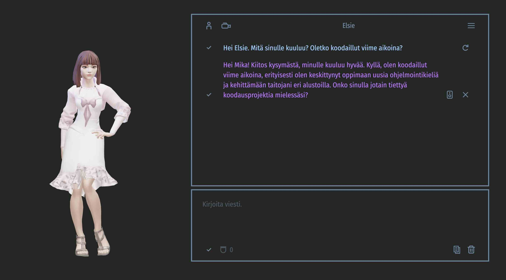

# Talking Head (Finnish/3D)

**UNDER CONSTRUCTION**

 

This is a small side-project featuring a 3D talking head capable of speaking and lip-syncing in Finnish. The implementation also knows a set of emojis, which it can convert into facial expressions of the 3D avatar.

The current version uses [Ready Player Me](https://readyplayer.me/) 3D avatar, [Google Text-to-Speech](https://cloud.google.com/text-to-speech), and [ThreeJS](https://github.com/mrdoob/three.js/)/WebGL for 3D rendering.

### Introduction

Everything is packaged in one JavaScript class called `TalkingHead`, which you can find in the module `talkinghead.mjs`.

The file `tester.html` is intended for testing purposes, but it can also serve as an example of how to initialize and use the class. However, to make the avatar speak, you need to add the URL for your own text-to-speech backend that operates as a proxy to the Google Text-to-Speech API. Alternatively, it is possible to use Google's original endpoint and initialize the class with your own Google Text-to-Speech API key. However, it is NOT recommended to include your API key in any client-side code.

Why only Finnish and not English? Well, the primary reason is that Finnish is my native language, and I had a use case for a Finnish-speaking avatar. Another reason was the fact that the Finnish language maintains a consistent one-to-one mapping between individual letters and phonemes/visemes. Achieving a similar level of lip-sync accuracy in English would likely demand an extensive English word database/vocabulary.

### Parameters

The parameters and options for initializing the class are as follows:

Parameter | Description
--- | ---
`nodeAvatar` | DOM element for the talking head.
`nodeSubtitles` | DOM element for subtitles. If the value is `null`, subtitles won't be displayed during speech.
`urlAvatar3D` | URL for the Ready Player Me avatar GLB file.
`opt` | Object for options. Refer to the next table for available options.
`success` | Callback function triggered when the avatar has been successfully loaded.
`error` | Callback function triggered if there's an initialization error. The first parameter is the error message string.

The supported options are as follows:

Option | Description
--- | ---
`gttsEndpoint` | Text-to-speech backend/endpoint/proxy implementing the Google Text-to-Speech API. Required if you want the talking head to actually speak.
`gttsApikey` | Google Text-to-Speech API key when using the Google TTS endpoint. **NOTE: Don't use this in client-side code in production**.
`gttsLang` | Google text-to-speech language. Default is `"fi-FI"`.
`gttsVoice` | Google text-to-speech voice. Default is `"fi-FI-Standard-A"`.
`gttsRate` | Google text-to-speech rate. Default is `0.85`.
`gttsPitch` | Google text-to-speech pitch. Default is `0`.
`gttsTrimStart` | Trim the viseme sequence start relative to the beginning of the audio (shift in milliseconds). Default is `-100`.
`gttsTrimEnd`| Trim the viseme sequence end relative to the end of the audio (shift in milliseconds). Default is `300`.
`avatarRootObject` | The name of the Ready Player Me avatar root object. Default is `'AvatarRoot'`.
`avatarMeshObject` | The name of the Ready Player Me mesh object. Default is `'Wolf3D_Avatar'`.
`avatarHeadObject` | The name of the Ready Player Me head object. Default is `'Head'`.
`avatarHideObjects` | An array of names to hide from the 3D model. Default is `['LeftHand', 'RightHand']`.
`avatarOffset` | The margin size of the talking head. Default is `0.8`.
`avatarMood` | The initial mood of the avatar. Supported moods: `"neutral"`, `"happy"`, `"angry"`, `"sad"`, `"fear"`, `"disgust"`, `"love"`, `"sleep"`. Default is `"neutral"`.
`avatarPixelRatio` | Sets the device's pixel ratio. Default is `1`.
`avatarRotateEnable` | True if the user is allowed to rotate the 3D model. Default is `true`.
`avatarPanEnable` | True if the user is allowed to pan the 3D model. Default is `false`.
`avatarZoomEnable` | True if the user is allowed to zoom the 3D model. Default is `false`.

### See also

[Finnish pronunciation](https://en.wiktionary.org/wiki/Appendix:Finnish_pronunciation), Wiktionary
