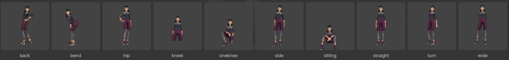

# MPFB with TalkingHead

> [!IMPORTANT]
> This document is a Work-In-Progress.

### Installation

[Blender](https://www.blender.org/) is free and open-source 3D software, and
[MPFB](https://static.makehumancommunity.org/mpfb.html) is a free and
open-source Blender extension:

- Download and install the latest version of [Blender](https://www.blender.org/)
- Start Blender
- Select `Edit` | `Preferences` | `Get extensions`, and allow online access
(if you have not already done so)
- Search for the "MPFB" extension and click `Install`.

If you now return to Blender's "Layout" view and enable `View` | `Sidebar`,
you should see a new tab labeled "MPFB v2.0.14" (or later).

Install MPFB asset packs for skins, clothes, and other 3D assets:

- In Blender, open the "MPFB" tab | `System and resources` | `Web resources` | `Asset packs`
- Download the "MakeHuman system assets" and all other zipped asset packs
that you want. No need to download them all as you can always add more later.
- From "Functional asset packs" section, download "Visemes 02" (Meta/Oculus style visemes)
and "Faceunits 01" (ARKit style face units) asset packs
- Install each pack to MPFB: `Apply assets` | `Library Settings` | `Load pack from zip file`
- Restart Blender

Install the TalkingHead add-on and assets:

- Download the TalkingHead add-on [talkinghead-addon.py](https://github.com/met4citizen/TalkingHead/blob/main/blender/MPFB/talkinghead-addon.py),
rig [talkinghead.mpfbskel](https://github.com/met4citizen/TalkingHead/blob/main/blender/MPFB/talkinghead.mpfbskel),
and weights [talkinghead.mpw](https://github.com/met4citizen/TalkingHead/blob/main/blender/MPFB/talkinghead.mpw)
to a local directory. <sup>\[1]</sup>
- Install the TalkingHead add-on via `Edit` | `Preferences` | `Add-ons` | `Install from Disk...`.
Open preferences and set the "Data Directory" to the directory where you saved the downloaded files.
- Workaround to enable refitting with a custom rig: In the MPFB tab, click
`System and resources` | `System data` to open the system data folder.
Navigate to "./rigs/standard" and copy "talkinghead.mpfbskel" to "rig.unknown.json"
and "talkinghead.mhw" to "weights.unknown.json". <sup>\[2]</sup>


### Create A New Avatar

Create a new human model:

- Open the "MPFB" tab and select `New human` | `From scratch`.
- Specify basic options like Gender, Age, Height and other
parameters.
- Click `Create human`.
- Make more detailed adjustments to the base model in
the `Model` section.
- Load the TalkingHead rig: `Developer` | `Load rig` |
"talkinghead.mpfbskel".
- Load the TalkingHead weights : `Developer` | `Load weights` |
"talkinghead.mhw".
- Navigate to `Apply assets` | `Library Settings`. Make sure all
the material types are set to "GameEngine (PBR)" and uncheck
"Material instances".
- Select `Apply assets` and pick body parts (skin, eyes, eyebrows,
eyeslashes, teeth, tongue, hair) and an outfit.

Make changes to your design and fine-tune. If you later return
and modify the base model, click `Model` | `Refit assets to basemesh`.

### Poses and Animations

The TalkingHead rig is designed to be Mixamo-compatible.
You can simply use the Mixamo "X-Bot" to download poses
and animations. For most use cases, this approach gives
a good enough result.

If you want to adjust the built-in poses, you can install
them as Blender assets:

- Download the TalkingHead assets [talkinghead-assets.zip](https://github.com/met4citizen/TalkingHead/blob/main/blender/MPFB/talkinghead-assets.zip),
unzip and install as a new Blender asset library: `Edit` |
`Preferences` | `File Paths` | `Asset Libraries` |  Add the folder.
- Select the avatar and switch to `Layout` | `Pose Mode`.
- Change the rotation mode of all your pose bones:
Select one bone | Select all bones | While holding
down Option/Alt key change the bone rotation mode to "Quaternion".
- Display the set of poses by enabling `View` | `Asset Shelf`.



Now you should be able to apply a pose and adjust it. If you
want to use the adjusted pose in your app, select the required bones
and copy quaternions to clipboard: `TalkingHead` | `Operations` | `Copy pose`.
Paste data to your code as a part of `head.poseTemplates` or `head.gestureTemplates`.

If you want to create character-specific animations, you can
create an avatar-specific "doll", export it to FBX, upload to
Mixamo, and download model-specific FBX animations.


### Export as GLB file

Make an export copy:

- Select your design armature and navigate to "MPFB" tab | `Operations` | `Export copy`.
- For Basemesh, select "Bake mask modifiers", "Bake subdiv modifiers",
"Bake modelling shapekeys" and "Delete helpers".
- For visemes and faceunits, select "Load meta-style visemes",
"Load arkit-style visemes", and "Interpolate visemes and faceunits".
- Click `Create export copy`
- Check that the root object of the new export copy is named "Armature".
This is the default value for the TalkingHead class-level option `modelRoot`.
- Optional: Select the armature | `TalkingHead` | `Operations` | `Scale character`.
- Optional: Select the armature | `TalkingHead` | `Operations` | `Fix bone axes (A-pose)`. <sup>\[3]</sup>
- Select all | `Object` | `Apply` | `All Transforms`.

Update materials for glTF/GLB:

- OPAQUE: For meshes that do NOT require any kind of transparency,
remove alpha map textures from `Material` | `Surface` | `Alpha`
- MASK / Alpha Clip: For meshes that need cutout transparency
go to `Shading` and add a new Math node before the Principled
BSDF Alpha input: `Add` | `Utilities` | `Math` | `Math` | "Greater Than".
Adjust the threshold value until the edges look correct. <sup>\[4]</sup>
- BLEND: For meshes that must have partially transparent surfaces,
leave the material setup as it is.

Note: By default, the original design and the export copy share
materials data-blocks. If you want a separate material for you export
copy, navigate to the material and click the number of its users to make
a single-user copy.

Export to GLB (settings relative to defaults):

- Select all objects in the export copy and navigate to `File`| `Export` | `glTF 2.0`.
- Select format "glTF Binary (.glb)".
- Check `Include` | Limit to "Selected Objects".
- Uncheck "Animation".
- Click `Export`.

### Compression (Optional)

Use [glTF-Transform](https://github.com/donmccurdy/glTF-Transform)
to apply compression:

```bash
gltf-transform optimize avatar.glb avatar-compressed.glb \
  --compress meshopt \
  --texture-compress webp
```


### Troubleshooting

Here are few common problems and known issues:

- Avatar is looking down instead of straight ahead:
Adjust the tilt of the "Head" bone in your export copy.
Remember to apply all transforms.
- Eyelashes extend too far when blinking: Either modify
the shape key directly or replace it with a combined mix
that provides an optimal extent.

This document does not (and cannot) cover all details or possible
situations. If you encounter difficulties, please consult the
[Blender manual](https://docs.blender.org/manual/en/latest/) and/or
[MPFB documentation](https://static.makehumancommunity.org/mpfb.html).

---

### Footnotes

\[1] Custom rig was necessary because the standard MPFB rigs (Mixamo with and
without Unity extensions) had bone rolls that were not aligned with
Mixamo's de facto standard. Minor adjustments were also made
to the naming (removed mixamorig prefix), spine, neck alignment,
head tilt, toes, and other places.

\[2] This is a hack. See [MPFB2 issue](https://github.com/makehumancommunity/mpfb2/issues/305).
This will be fixed in the next MPFB release.

\[3] When designing your model, the bone axes/rolls can change. If these
changes are NOT fixed before export, Blender bakes them into GLB matrices
and the final model will have twisted body parts such as twisted toes.

\[4] Mask mode is essentially the same as Eevee's "Alpha Clip" blend mode,
but in Blender 5.0 it must now be done with shader nodes.

